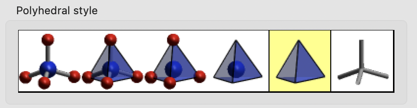
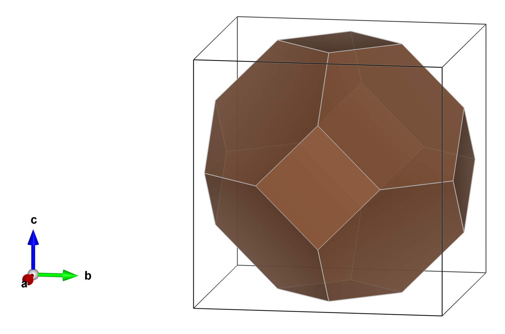

# bzvis.py

Generate a CIF file that can be used to visualize the first Brillouin zone in VESTA.

## Usage
```
python bzvis.py -i POSCAR -o bz_NaCl       # generates bz_NaCl.cif 
```
or
```
python bzvis.py -i NaCl.cif -o bz_NaCl     # generates bz_NaCl.cif
```
The following output appears, and the file bz_NaCl.ci is generated.
```
[bzvis] bz_NaCl.cif written – 24 vertices; max R = 0.644088 Å⁻¹; real F → reciprocal I.
```
The ```max R``` value is also written at the top of the generated .cif file as follows, which will be used later when visualizing the Brillouin zone in VESTA.
```
# max_BZ_radius  0.644088  Angstrom^-1
```

## Visualizing in VESTA 
1. Open the created CIF file (such as bz_NaCl.cif) in VESTA
2. Edit => Bonds... Create C–X bonds with Max. length set to a value slightly larger than the ```max R``` (say, 0.64489).
3. In the Style pane, choose **Polyhedra**.
4. Objects => Properties => Polyhedra... Select the following polyhedral style:

5. You should see something like this. Enjoy rotating your Brillouin zone!
